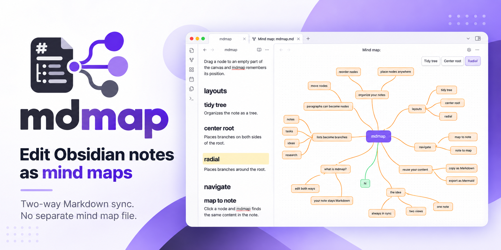
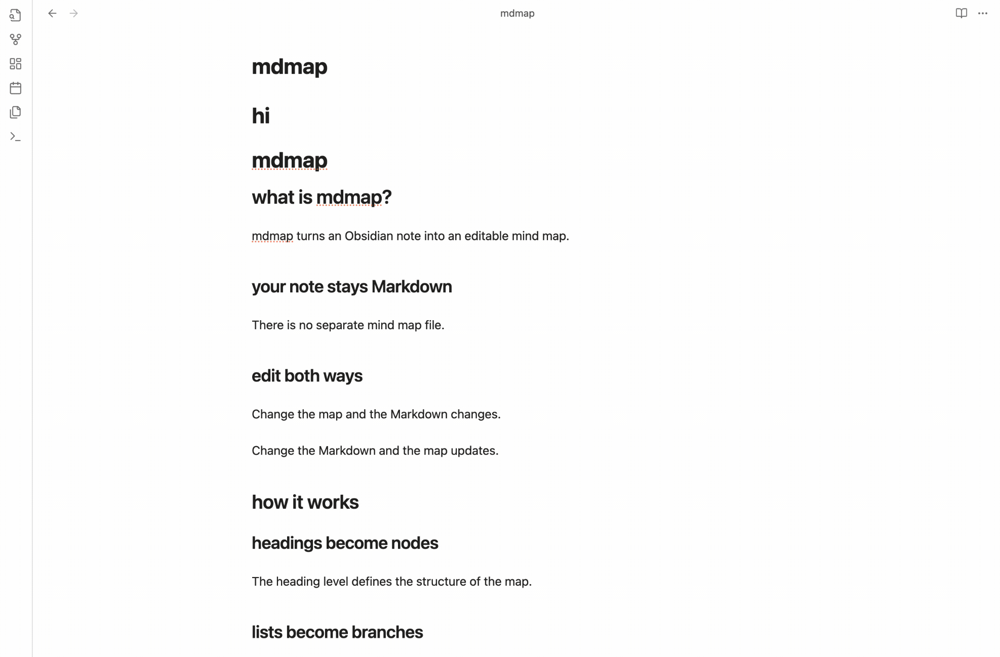

# mdmap

Edit Obsidian notes as mind maps.

Changes in the map are written to the note, and changes in the note show up
in the map. The Markdown note is the only place the content is stored; there
is no separate mind map file.



[Install](#install) · [Features](#features) · [Issues](https://github.com/pererinha/mdmap/issues) · [Changelog](CHANGELOG.md) · [Sponsor](https://github.com/sponsors/pererinha)

## Features

- **Headings, list items and paragraphs as nodes.**
- **Two-way sync.** Edit the map and the note changes; edit the note, in
  Obsidian or another app, and the map updates.
- **Drag and drop.** Drag a node onto another node to change its parent, or
  to an empty part of the map to keep it there.
- **Automatic layouts.** *Tidy tree*, *Center root* and *Radial* place every
  node without overlaps.
- **From the map to the note and back.** Click a node to highlight its line
  in the note; put the cursor on a heading in the note to select its node.
- **Copy a branch as Markdown**, exactly as it is written in the note.
- **Mermaid export.** Copy the whole note as a Mermaid `mindmap` block.
- **Images and videos** embedded in the note are shown inside their node.
- **Undo and redo** for changes made in the map.

## How it works

This note:

```markdown
# Trip

## Packing
- Passport
- Charger

## Plan
Leave early to beat the traffic.

Keep the receipts.

Stops:
1. Lyon
2. Turin
```

becomes this map:

```
Trip
├── Packing
│   ├── Passport
│   └── Charger
└── Plan
    ├── Leave early to beat the traffic.   (both paragraphs, one node)
    └── Stops:
        ├── Lyon
        └── Turin
```

Add a child named *USB-C cable* under *Charger* in the map, and the note
gets it as a nested item:

```markdown
- Charger
  - USB-C cable
```

- The heading level sets how deep a node is. When you move a node, the
  plugin updates the heading levels of the node and everything under it.
- If a note has more than one top-level heading, the map adds a root node
  named after the file.
- Paragraphs that follow one another are one node, which shows up to six
  lines of text; hover over it to see the rest. A list right after a
  paragraph becomes that paragraph's children.
- Tables, code blocks, quotes and embeds belong to the node before them and
  move with it.
- A node shows the first line of its content under its title.

## Install

The plugin is not in the community directory yet. To install it manually:

1. Download `main.js`, `manifest.json` and `styles.css` from a
   [release](https://github.com/pererinha/mdmap/releases) into
   `<vault>/.obsidian/plugins/mdmap/`, or build them from the source code
   directly into the vault (see [Development](#development)).
2. Turn on *mdmap* in **Settings → Community plugins**.
3. Open a note and run **Edit current note as mind map** from the command
   palette. The map opens next to the note.

## Keyboard and mouse

| Action | Input |
|---|---|
| Rename | Double-click the node, type, press Enter (Escape cancels) |
| Add a child | Tab |
| Add a sibling | Enter |
| Delete | Delete or Backspace |
| Move up or down among siblings | Alt+Up / Alt+Down |
| Move to another parent | Drag the node onto the new parent |
| Place a node anywhere | Drag the node to an empty part of the map; the nodes under it move with it |
| Copy a node and the nodes under it as Markdown | Hover over the node and click the copy icon in its corner |
| Undo / redo | Cmd+Z / Cmd+Shift+Z (Ctrl on Windows and Linux) |
| Move around the map | Scroll with two fingers on a trackpad or with the mouse wheel, or drag an empty part of the map |
| Zoom | Pinch on a trackpad, or Cmd+scroll (Ctrl on Windows and Linux) |

The command **Copy current note as Mermaid mindmap** copies the whole note to
the clipboard as a Mermaid `mindmap` block.

## Settings and details

**List items and paragraphs as nodes** (on by default, in *Settings →
mdmap*). When it is off, only headings are nodes, and list items and
paragraphs belong to the heading above them. The change applies the next
time you open a mind map.

**Show clicked node in the note** (on by default, in the gear menu of the
map's header). When it is off, clicking a node only selects it in the map.

**Where positions are saved.** When you drag a node to an empty part of the
map, the plugin adds a comment block at the end of the note:

```
%% mindmap-positions
Pesquisa/Artigos: -54,149
%%
```

Each line has the node's path (the titles from the root down, separated by
`/`) and its x,y distance from the top-left corner of its parent, so the
node stays next to its parent when the parent moves. Obsidian hides `%%`
comments in reading view. The plugin deletes the block when no node has a
saved position, for example after you click *Tidy tree*.

**Images and videos from the internet.** If an embedded image or video links
to an `http://` or `https://` address, the plugin downloads it from that
address when it shows the node, so the server at that address receives a
request from your computer. Images and videos stored in the vault are read
from the vault.

## Support mdmap

If mdmap is useful to you, you can support its development on [GitHub Sponsors](https://github.com/sponsors/pererinha).

## Development

```sh
git clone https://github.com/pererinha/mdmap.git
cd mdmap
npm install
npm run build     # builds main.js; with MDMAP_VAULT=/path/to/vault it also copies the plugin into that vault
npm test          # unit tests for reading and writing Markdown, the layouts and the Mermaid export
```

To run tests in a real Obsidian app, see [e2e/README.md](e2e/README.md).

## Release

1. Set the new version in `manifest.json` and `package.json`, and describe
   the changes in [CHANGELOG.md](CHANGELOG.md).
2. Push a tag with exactly that version and no `v` (`1.0.1`, not `v1.0.1`).
   Obsidian finds the release by this name.
3. The [release workflow](.github/workflows/release.yml) runs the tests,
   builds the plugin, and publishes `main.js`, `manifest.json` and
   `styles.css` in a GitHub release named after the tag.

## License

MIT, see [LICENSE](LICENSE). Built with [React Flow](https://reactflow.dev);
the licenses of the packages included in the build are in
[THIRD_PARTY_LICENSES.md](THIRD_PARTY_LICENSES.md).
